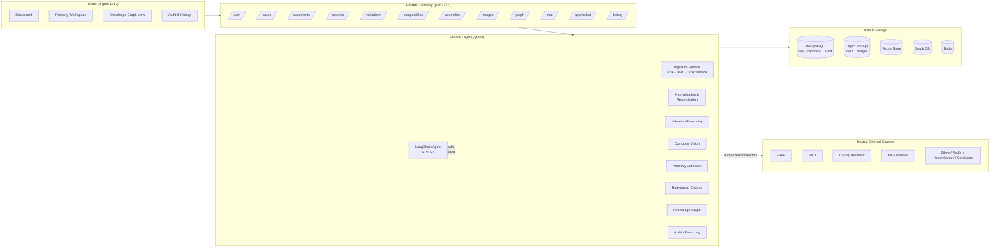
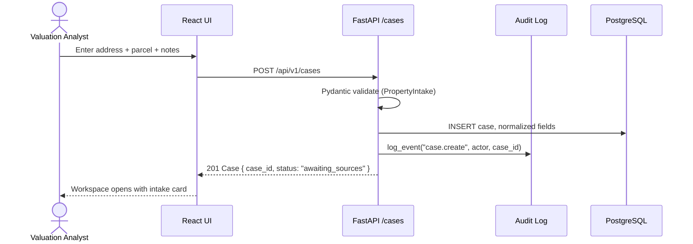
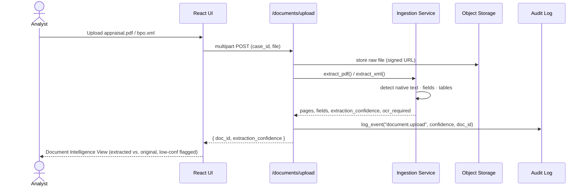
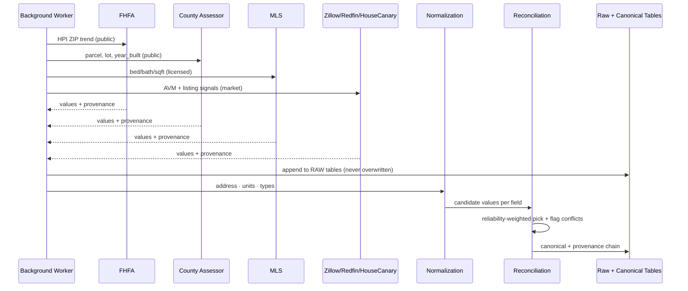
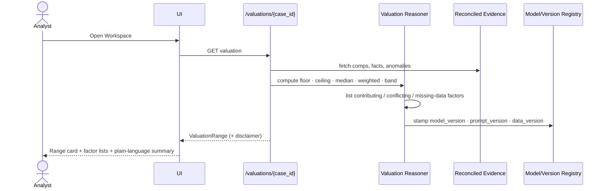
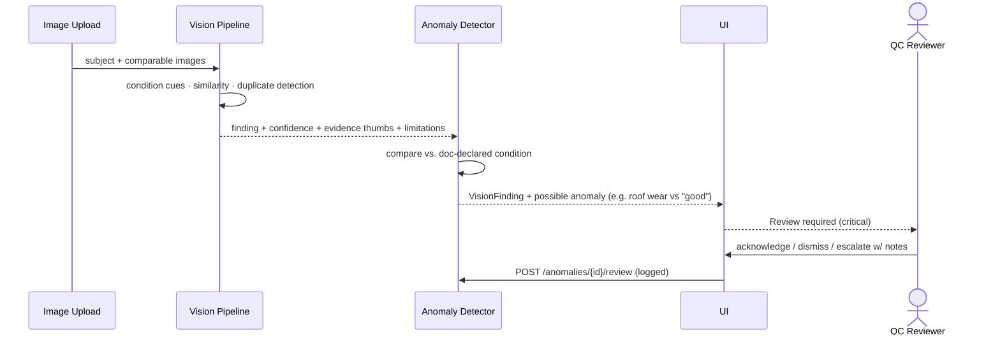
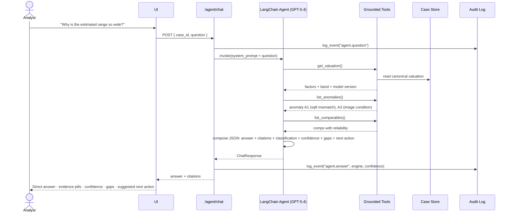
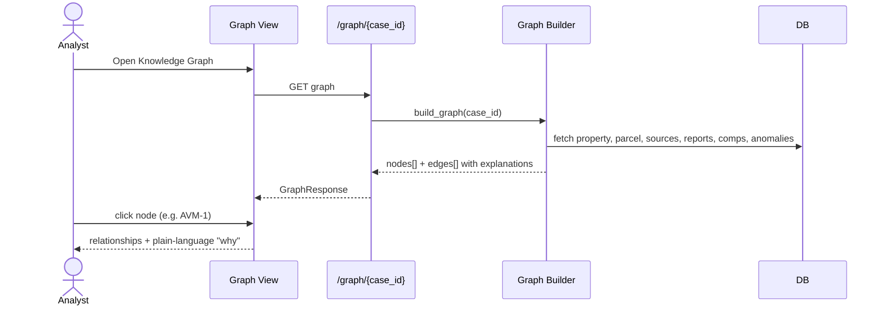
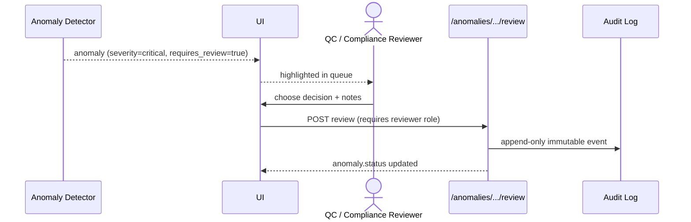
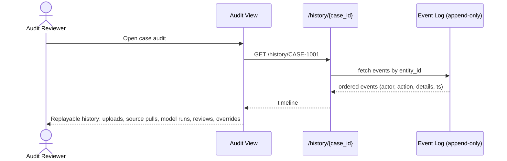

# Agentic AI Property Valuation and Property Designation Assistant

An analyst-facing decision-support application that ingests fragmented property and
market data, extracts valuation products (PDF/XML), analyzes property imagery, reconciles
evidence across sources, detects anomalies, and answers drill-down questions through an
evidence-grounded LangChain agent — with full provenance, confidence, and audit trail.

> **Disclaimer.** This system provides analyst decision-support only. It is not a
> licensed appraisal, lending, legal, or compliance judgment. Every material output
> carries source provenance, a confidence score, and a human review checkpoint.

---

## Quick start

```bash
cp .env.example .env          # then edit .env and set OPENAI_API_KEY
./start.sh                    # backend on :2727, frontend on :1717
# visit http://localhost:1717
./stop.sh
```

- **Frontend:** <http://localhost:1717>
- **Backend API:** <http://localhost:2727/health> · Swagger at `/docs`
- **Demo login:** `analyst / demo` (roles: `analyst`, `reviewer`, `compliance`, `auditor`, `admin`)
- **Mock mode** is on by default — the system runs without real source APIs using a seeded `CASE-1001`.

---

## Architecture overview



**Principles**

- Evidence-first: every number carries `source_name`, `retrieval_timestamp`, `reliability_score`, `confidence`.
- Facts · estimates · inferences · model outputs are stored and displayed separately.
- Raw source truth is never overwritten — reconciliation sits in a separate layer.
- Human-in-the-loop is required for `moderate` and `critical` anomalies.

---

## Repository layout

```
challengex-fnma/
├── start.sh · stop.sh · .env.example
├── backend/
│   ├── requirements.txt
│   └── app/
│       ├── main.py                 # FastAPI app, CORS, correlation IDs
│       ├── api/routes.py           # /api/v1/* endpoints
│       ├── core/
│       │   ├── config.py           # settings (pydantic-settings)
│       │   ├── security.py         # JWT, RBAC, demo user store
│       │   └── audit.py            # append-only event log
│       ├── models/schemas.py       # Pydantic contracts w/ provenance + confidence
│       ├── services/
│       │   ├── ingestion.py        # PDF (pypdf) + XML (lxml) extraction
│       │   ├── chatbot.py          # deterministic rule-based drill-down
│       │   └── agent.py            # LangChain agent w/ grounded tools (GPT-5.4)
│       └── data/mock_store.py      # seeded demo case CASE-1001
└── frontend/
    ├── package.json · vite.config.ts · tsconfig.json · index.html
    └── src/
        ├── App.tsx · main.tsx · styles.css
        ├── api/client.ts
        └── pages/{Dashboard,Workspace,GraphView,Audit}.tsx
```

---

## LangChain agent (GPT-5.4)

The `/api/v1/agent/chat` endpoint runs a tool-using agent whose tools are bound to the
case store. The LLM cannot see anything the tools don't return, which keeps answers
**grounded in case evidence** rather than model priors.

**Tools exposed to the agent (read-only):**

- `get_valuation` — current range + contributing/conflicting factors
- `list_comparables` — comparables with provenance and reliability
- `list_anomalies` — anomalies with severity and evidence
- `list_documents` — uploaded PDF/XML valuation products
- `list_vision_findings` — CV findings with confidence and limitations
- `get_property_facts` — normalized sqft/beds/baths/lot/year w/ source

**System-prompt invariants** (see [`backend/app/services/agent.py`](backend/app/services/agent.py)):
answer only from tool results, classify every answer (`fact` / `estimate` / `anomaly` /
`assumption` / `recommendation`), include confidence and data gaps, refuse legal or
appraisal certification, and never use or infer protected-class attributes.

If `OPENAI_API_KEY` is missing or the LLM call fails, the endpoint transparently falls
back to the deterministic rule-based chatbot so the UI stays functional. Both paths are
logged to the audit event store with engine name, classification, and confidence.

> **Security note.** The OpenAI API key you pasted during development was leaked in
> plaintext in a chat transcript. **Rotate it immediately** and re-issue a fresh key
> into `.env` (which is `.gitignored`).

---

## Sequence flows (mermaid)

### 1. Property intake → case creation



### 2. Document ingestion (PDF / XML)



### 3. Source aggregation & reconciliation



### 4. Valuation reasoning with explainability



### 5. Computer vision finding



### 6. Chatbot drill-down (LangChain agent)



### 7. Knowledge graph drill-down



### 8. Anomaly review workflow (human-in-the-loop)



### 9. Audit timeline replay



---

## Data model highlights

- **Raw-source tables** — immutable, one row per retrieval with full provenance.
- **Canonical tables** — normalized values with reliability-weighted chosen source.
- **Reconciliation tables** — conflict records (never silently merged).
- **Event log** — append-only, correlation-ID tagged; source of truth for audit.
- **Model run table** — every AI call records model, prompt version, data version, confidence, classification.

Every `ValuedField` carries both `raw_value` and `normalized_value`, plus a `SourceProvenance`
with `source_name`, `source_url`, `retrieval_timestamp`, `access_method`, `freshness_days`,
`reliability_score`, and `legal_basis`.

---

## API surface (v1)

| Domain       | Verb | Path                                         | Notes |
|--------------|------|----------------------------------------------|-------|
| Auth         | POST | `/api/v1/auth/login`                         | JWT + role |
| Cases        | GET/POST | `/api/v1/cases`, `/cases/{id}`           | intake, listing |
| Documents    | POST | `/api/v1/documents/upload`                   | PDF / XML; returns extraction confidence |
| Sources      | GET  | `/api/v1/sources/available`                  | reliability scores |
| Valuation    | GET  | `/api/v1/valuations/{case_id}`               | floor/ceiling/band + factors |
| Comparables  | GET  | `/api/v1/comparables/{case_id}`              | provenance + similarity |
| Anomalies    | GET/POST | `/api/v1/anomalies/{case_id}[/{id}/review]` | RBAC: reviewer roles |
| Images       | GET  | `/api/v1/images/{case_id}/findings`          | CV findings + limitations |
| Graph        | GET  | `/api/v1/graph/{case_id}`                    | nodes + edges w/ explanations |
| Chat         | POST | `/api/v1/chat`                               | deterministic rule-based |
| Agent        | POST | `/api/v1/agent/chat`                         | LangChain + GPT-5.4 |
| History      | GET  | `/api/v1/history/{case_id}` · `/history`     | timeline (global: auditor role) |
| Reports      | GET  | `/api/v1/reports/{case_id}/summary`          | export payload |

Every request/response is typed (Pydantic); every call gets an `X-Correlation-Id` header.

---

## Compliance regulations followed

The application is designed to support analyst workflows under the following U.S.
housing, fair-lending, privacy, accessibility, and AI-governance regimes. This is a
technical-controls map, **not a legal certification** — compliance ownership sits with
the deploying institution's Legal, Compliance, and Risk functions.

| # | Regulation / Framework | Scope | How the system supports compliance |
|---|------------------------|-------|------------------------------------|
| 1 | **Fair Housing Act (FHA, 42 U.S.C. §3601 et seq.)** | Prohibits discrimination based on race, color, religion, sex, disability, familial status, national origin | Protected-class attributes are excluded from the data model, agent prompt, and reasoner; agent system prompt forbids use or inference; proxy-feature review flag route exists |
| 2 | **Equal Credit Opportunity Act (ECOA) / Regulation B (12 CFR Part 1002)** | Fair lending, adverse-action reasons | Valuation outputs include **factor-level explanations** (contributing / conflicting / missing-data factors) suitable for adverse-action reason codes; no black-box final decisions |
| 3 | **HUD Fair Housing guidance on appraisal bias (PAVE Task Force)** | Property-valuation discrimination | Human review required for `moderate` and `critical` anomalies; appraisal vs. AVM vs. BPO vs. market signals kept **separately visible**; vision findings carry limitations statements |
| 4 | **Interagency Guidance on Model Risk Management (SR 11-7 / OCC 2011-12)** | Model governance | Every model output stamps `model_version`, `prompt_version`, `data_version`; append-only event log provides reproducibility; confidence displayed; fallback paths visible |
| 5 | **CFPB guidance on Automated Valuation Models (AVMs) — Dodd-Frank §1473(q)** | AVM quality controls: accuracy, data integrity, conflict-of-interest, random sample testing, anti-discrimination | Reliability-weighted multi-source reconciliation; raw vs. normalized retained; conflict flags surfaced; audit trail enables testing samples; protected-class exclusion |
| 6 | **Fair Credit Reporting Act (FCRA, 15 U.S.C. §1681)** | Consumer reports require permissible purpose | Consumer-report / tenant-screening / credit-adjacent data is **segregated** behind access controls with purpose checks and an auditable access trail; never mixed into general model context |
| 7 | **Gramm-Leach-Bliley Act (GLBA) — Safeguards Rule** | Non-public personal info (NPI) protection | Encryption in transit and at rest, role-based access control, secrets management, signed URLs for document/image access, redaction of secrets from logs |
| 8 | **State privacy laws — CCPA/CPRA, VCDPA, CPA, etc.** | Consumer rights: access, deletion, opt-out | Data classified by sensitivity; retention rules by document/source class; deletion + legal-hold + audit-retention patterns supported |
| 9 | **NIST AI Risk Management Framework (AI RMF 1.0) — Govern · Map · Measure · Manage** | Trustworthy AI characteristics | Explainability (factor lists + citations), reliability (confidence + limitations), safety (human review gates), accountability (audit log + model registry), validity (source grounding), fairness (protected-class exclusion + fairness-review flag) |
| 10 | **NIST SP 800-53 / 800-63 (access control, auth)** | Federal security baseline | JWT auth, RBAC for analyst / reviewer / compliance / auditor / admin, least-privilege endpoints, rate-limiting surface, environment separation |
| 11 | **OWASP ASVS / Top 10** | Application security | Typed request validation, structured errors, correlation IDs, CORS allow-list, file-type validation on uploads, prompt-injection-resistant retrieval (agent tools return structured JSON only) |
| 12 | **WCAG 2.1 AA · Section 508** | Accessibility | Semantic landmarks (`nav`, `main`, `role=region`), keyboard-friendly controls, ARIA labels, high-contrast palette, no color-only signaling, plain-language summaries under charts, abbreviation expansion on first use (AVM, FHFA, HUD, BPO, MLS) |
| 13 | **NY DFS Part 500 / EU AI Act (high-risk AI transparency)** | AI transparency, oversight | User-visible disclaimer that the tool is decision-support (not licensed appraisal); AI use is logged with task, model, prompt version, sources, confidence, limitations |
| 14 | **Data-provider licensing & terms (MLS IDX rules, Zillow/Redfin/HouseCanary/CoreLogic ToS, robots.txt)** | Contractual / access-control compliance | Source connectors respect authorized integration paths; `legal_basis` recorded per retrieval; no scraping in violation of provider permissions |

### Responsible-AI controls (summary)

- **Explainability** — factor-level reasons on every estimate; citations on every chatbot answer.
- **Traceability** — append-only event log · model/prompt/data version stamping · correlation IDs.
- **Human-in-the-loop** — moderate/critical anomalies cannot be auto-closed.
- **Source grounding** — agent tools are the only path to facts; no free-form "recall".
- **Confidence & limitations** — displayed on every AI output, never hidden.
- **Fairness** — protected-class attributes excluded from schemas and prompts; proxy-feature review route.
- **Reproducibility** — deterministic fallback; versioned prompts; immutable event log enables replay.

---

## MVP scope (implemented in this repo)

- [x] Property intake (address + parcel + notes)
- [x] PDF/XML upload with extraction confidence
- [x] Source catalog (FHFA, HUD, County Assessor, MLS, Zillow, Redfin, HouseCanary, CoreLogic)
- [x] Comparable property table with provenance
- [x] Anomaly detection w/ severity + evidence + review gate
- [x] Valuation guidance range with factor lists + version stamps
- [x] Chatbot drill-down (rule-based + LangChain agent with GPT-5.4)
- [x] Knowledge graph view (nodes + edges + explanations)
- [x] Audit trail (append-only event log)
- [x] JWT auth + role-based access control
- [x] Mock-data mode so the demo runs with zero external dependencies

## Phase-wise roadmap

1. **Phase 1 (this MVP)** — local mock, LangChain agent, seeded case, UI skeleton.
2. **Phase 2** — PostgreSQL + S3 + Redis + real source connectors (FHFA, HUD, one market source).
3. **Phase 3** — Neo4j knowledge graph, vector store for doc retrieval, OCR fallback, CV model.
4. **Phase 4** — Production hardening: SSO/SAML, KMS, WAF, SOC 2 controls, model-monitoring, bias testing.
5. **Phase 5** — Multi-tenant, export to GSE-compatible formats, regulator-facing reports.

## Risks, assumptions, open questions

- "GPT-5.4" is used per project directive; swap `OPENAI_MODEL` in `.env` if a different model is required.
- Mock store is in-memory and resets on restart; production deployments must migrate to PostgreSQL + S3.
- Vision findings in the demo are illustrative; real deployment needs a trained model plus human calibration.
- Protected-class exclusion relies on input schemas — production must add automated proxy-feature scans.

---

## Testing suggestions

- **Unit:** Pydantic contract tests for `ValuedField` and `ValuationRange`; ingestion service on sample PDF/XML.
- **Integration:** `/cases` → `/documents/upload` → `/valuations` happy path; RBAC denial paths.
- **Agent:** snapshot tests that assert the agent never returns a numeric claim without a citation.
- **Fairness:** fuzz tests that inject protected-class-like fields and assert they never appear in prompts or outputs.
- **Audit:** verify every state-changing endpoint appends an immutable event.
